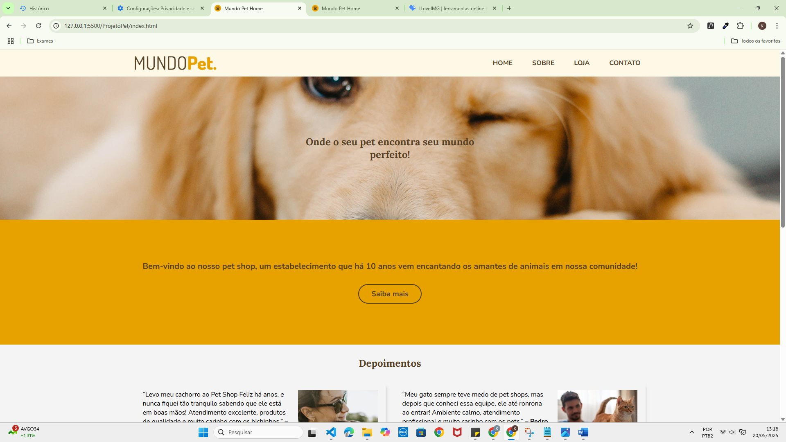
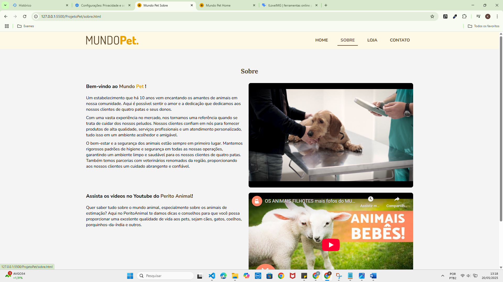
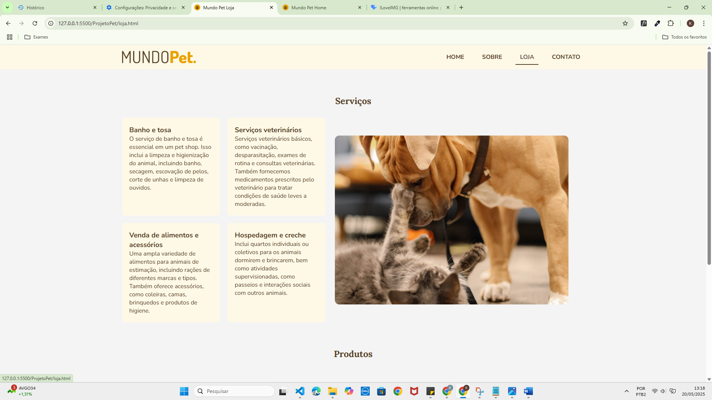
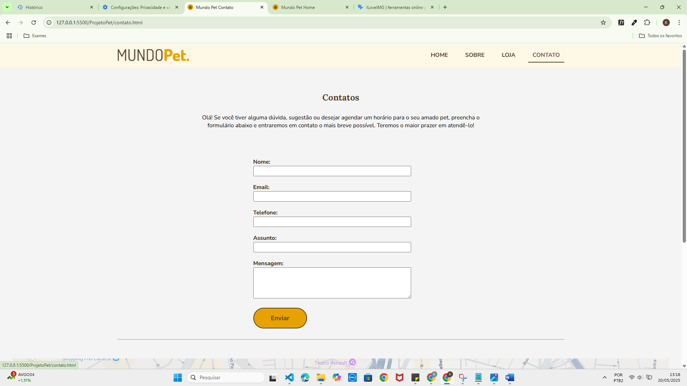

# 🌐 Mundo Pet

Este é um projeto de site fictício para um pet shop, feito com HTML e CSS, desenvolvido pelo SENAI PLAY e adaptado para ser responsivo

## 🧩 Páginas desenvolvidas:
- `index.html` – Página inicial
- `sobre.html` – Sobre a empresa
- `loja.html` – Produtos e serviços
- `contato.html` – Formulário e localização

## 🛠️ Tecnologias Utilizadas:
- `HTML5`
- `CSS3`
- `Flexbox`
- `Google Fonts`
- `Responsividade com @media`
- `Git & GitHub`

## 👩‍💻 Aluno:
- Nome: [Seu Nome Aqui]

---

## 🖼️ Prints do site (inserir abaixo):

